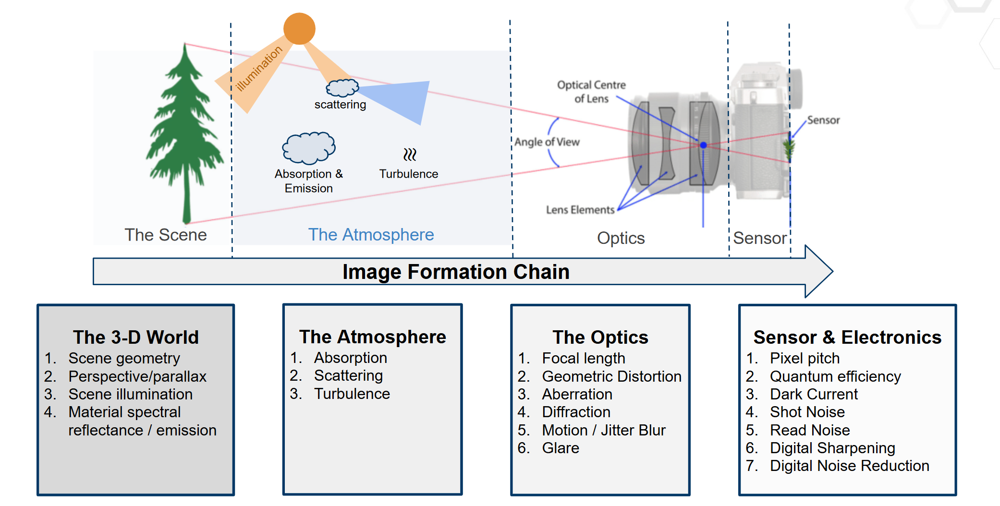
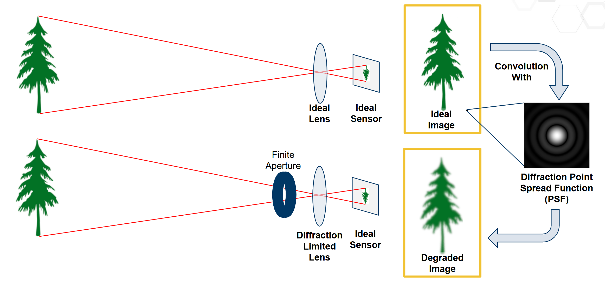

.. _abbe's diffraction limit: https://www.microscopyu.com/techniques/super-resolution/the-diffraction-barrier-in-optical-microscopy

##########################
 Image Formation Concepts
##########################

pyBSM replicates image formation based on the physical and electronic characteristics of the sensor and scene. The pyBSM
image formation chain consists of 4 separate components:

-  **3D World**: Physical geometry and materials of the scene
-  **Atmosphere**: Scattering, absorption, and turbulence
-  **Optics**: Image formation through lenses and apertures
-  **Sensor and Electronics**: Detection, digitization, and noise modeling

These components are illustrated below:



Figure 1: This modular structure underpins all simulations in pyBSM.

Ultimately, pyBSM bases its models and simulations around this image formation pipeline.

*****************************************************************
 Point-Spread Function (PSF) and Optical Transfer Function (OTF)
*****************************************************************

pyBSM is built on the principle of *translation-invariant systems*, or that the image process can be described by a set
of functions that degrade the ideal image scenario. Fundamental to this principle is the simulation of Point-Spread
Functions (PSFs) and Optical Transfer Functions (OTFs), which describe how an ideal scene is transformed as light
reaches the sensor. A PSF is a function that is convoluted with the scene to create the degradations, while at OTF is
the same thing except in the frequency domain (i.e. an OTF is the Fourier transform of a PSF). An OTF which has large
values for certain frequencies will faithfully replicate those frequencies on the sensor, while low values would
diminish or remove those frequencies entirely. For example, a diffraction-based OTF would have low values for
frequencies above `Abbe's diffraction limit`_, since the lens cannot reconstruct these frequencies. This OTF would also
therefore change based on the optics used, as a larger numerical aperture would afford a larger Abbe's diffraction
limit. A perfect and ideal OTF would be equal to 1 for all frequency values.



Figure 2: Description of PSFs

In pyBSM, the overall OTF and PSF of the system is called the "Composite System PSF", and is composed of a combination
of the PSFs from all the separate components:

-  Turbulence
-  Jitter and Drift
-  Diffraction
-  Defocus
-  Wavefront
-  Charge Diffusion
-  Detector


Figure 3: Depiction of all PSFs in pyBSM

It is important to note that each PSF degrades the ideal image and cannot enhance resolution. However, the interplay and
combination of many PSFs together is complex. Some examples of these OTFs are in
`NRTK/docs/examples/otf_visualization.ipynb`_

******************
 Image Simulation
******************

pyBSM allows the user to simulate different environmental or sensor effects for a given reference image and therefore
simulate new OTFs. Some practical examples include if the user wants to increase the sensor noise, change the distance
from the sensor to target, increase environmental wind speed, or change the aperature size of the lens.

To simulate the effects of these variables, pyBSM simulators are composed of three elementary classes:

-  **Sensor**: Defines the physical and electronic characteristics of the sensor and optics, including pixel pitch,
   focal length, aperture diameter, sensor noise, and spectral response.

-  **Scenario**: Captures details about the environment and scene, such as the observer's altitude and speed,
   atmospheric conditions, and the reflectance and temperature of the target.

-  **Reference Image**: Represents the baseline or *ideal image* from which degradations are simulated. It includes
   pixel intensity values, ground sampling distance (GSD), and optionally a mapping between pixel values and
   reflectance.


Figure 4: Depiction of simulator pipeline

An example notebook simulation is included in `NRTK/docs/examples/pybsm/pybsm_test.ipynb`_

Main Sensor Variables
=====================

The sensor class has the most variables in the simulator. If these are unknown or unspecified, they can be estimated via
the "estimate_capture_parameters" function in the ref_image class, but oftentimes they can be determined by the camera's
datasheet.

Overall, the main variables of interest can be separated into several categories:

**Pixel Size Parameters**: These include changes in the image due to the geometrical pixel sizes

-  ``p_x``, ``p_y``: center-to-center spacing between pixels in the x/y directions (meters). This is also known as
   ``pixel_pitch``, and this will change the resolution of the resulting image. Note if p_y is not provided, it is
   assumed to be equal ``p_x```` (``p_x`` *is required,* ``p_y`` *can be None*).

-  ``w_x``, ``w_y``: actual width of the photoreceptive component of the pixel (meters). Note that this should always be
   less than ``p_x`` , ``p_y``, since this describes the "fill factor."" If ``w_x`` = ``p_x`` and ``w_y`` = ``p_y``,
   fill factor is 1 and the entire pixel is photoreceptive. If ``w_x`` = 1/2 * ``p_x`` and ``w_y`` = 1/2 * ``p_y``, then
   the fill factor is .25 since the photoreceptive component only comprises 25% of the entire sensor area (*default
   None*).

**Lens and Optics** These parameters determine the projection of the scene onto the sensor:

-  ``f``: focal length of the lens (meters). A large focal length typically has a narrower field-of-view with compressed
   depth of the scene, while a smaller focal length has a wider field-of-view with exaggerated and distorted
   perspectives (*required*).

-  ``D``: effective aperture diameter of the lens (meters). This is related to the f-number (f#) of the lens, which
   defines the how much light is reaching the sensor alongside the depth of field and diffraction. A small aperture
   (i.e. small f#) results in less light and shallower depth-of-field but less diffraction and sharper images, while a
   large aperture (i.e. large f#) results in more light and deeper depth-of-field but less sharp images (*required*).

Here is a depiction of the pixel size and optics variables:


Figure 5: Depiction of sensor variables

**Spectral Response** These parameters define how the sensor responds to different wavelengths of light:

-  ``qewavelengths``, ``qe``: the detector quantum efficiency (QE) of the corresponding wavelengths (microns). QE
   defines what percentage of the incoming photons are converted to electrons by the sensor, where sensor which has a
   large QE with respect to a specific wavelength will capture that color more strongly than it would to one with a
   smaller QE. Note that QE cannot be greater than 1, as 1 is perfect efficiency. Most sensors will have the QE
   published. For a generic, high quality back-illuminated (BI) silicon sensor the values would be: qewavelengths:
   \[0.3, 0.4, 0.5, 0.6, 0.7, 0.8, 0.9, 1.0, 1.1\] (*default is opt_trans_wavelengths*)

-  ``qe``: [0.05, 0.6, 0.75, 0.85, 0.85, 0.75, 0.5, 0.2, 0] (*default ones*).

-  ``opt_trans_wavelengths``: specifies the start and end wavelengths the camera captures (meters). This is the
   "spectral bandpass."" Unless the optics of the camera are set specifically to isolate certain colors, this can be set
   as wide as the quantum efficiency, so the previous example would be 0.3e-6 to 1.1e-6 (*required*).

**Noise and Signal Quality**: These capture the noise and signal-to-noise (SNR) characteristics of the camera.

-  ``int_time``: maximum integration time of the sensor, or how long it converts photons to electrons (seconds). Also
   known as "exposure time." We use the term "maximum" since the image will be clipped depending on the monitor well
   fill percentage (i.e. max_n) (*default 1.0*).

-  ``bit_depth``: How many bits are used to represent the values in each pixel (bits). Standard 0-255 images are 8-bit,
   while larger bits capture more signal and a larger dynamic range of values (*default 100.0*).

-  ``read_noise``: electron noise created in reading out the pixels (root-mean squared electrons). This is especially
   problematic in dark scenes where the captured signal is low in which the read noise can overwhelm it (*default 0.0*).

-  ``dark_current``: the small amount of electrons going through each pixel even when no photons are entering (electrons
   per second). Dark current is what typically overwhelms low-light images (*default 0.0*).

-  ``max_n``: the detector electron well capacity (electrons). This is the maximum amount of electrons that can be
   captured by each pixel in the integration time (*default is 100e6*).

-  ``optics_transmission``: full system, in-band optical transmission (unitless). Not counting other qualities, how much
   of received light is captured by camera where the minimum is 0 and maximum is 1 (*default ones*).

-  ``s_x``, ``s_y``: root-mean-squared jitter amplitudes in the x and y directions (radians). These correspond to small,
   rapid motions that could come from internal vibrations or camera shake (*default 0.0*).

-  ``da_x``, ``da_y``: line-of-sight angular drift rate during one integration time in the x and y directions
   (radians/second). This relates to how the sensor's viewing direction drifts during an exposure time, such as would be
   from a moving aircraft. This would result in a blurred image in the direction of movement (*default 0.0*).


Some more uncommon variables not explained, but more information can be found at :ref:`sensor`

**Example Sensor Implementation Variables**

`Here <https://www.qhyccd.com/specifications-comparison/>`_ is an example of sensor variables from the Sony IMX455 CMOS
sensor with the Canon EF 200mm f/2.8L II USM `lens
<https://www.canon-europe.com/lenses/ef-200mm-f-2-8l-ii-usm-lens/specification.html>`_, which result in the following
sensor variables:

*Pixel and Optics*

-  ``p_x`` = ``p_y`` =3.76e-6
-  ``w_x`` = ``w_y`` = ``p_x`` (not given, but should be high because of BSI architecture)
-  ``f`` =35e-3
-  ``D`` > 32e-3

*Noise and Signal Quality*

-  40e-6 < ``int_time`` < 3600
-  ``bit_depth`` =16
-  ``dark_current`` =0.0022
-  1.0 < ``read_noise`` < 3.7
-  ``max_n`` = 51e3
-  ``s_x``, ``s_y`` depend on aircraft scenario
-  ``da_x``, ``da_y`` unclear

*Spectral Response* (based on `this document
<https://www.qhyccd.com/quantum-efficiency-performance-of-the-imx585-sensor-in-the-minicam8/>`_)

-  ``qewavelengths`` =[496e-9, 656.3e-9, 671.6e-9, 889e-9] (could use more wavelengths)
-  ``qe`` =[0.91, 0.81, 0.79, 0.40] (could use more wavelengths)
-  ``opt_trans_wavelengths`` [496e-9, 889e-9]

*Other Variables*

- ``pix_values``, ``refl_values`` are approximately linear to each other, based on
  how the electron well fills up with regards to exposure time
  (`document <https://www.qhyccd.com/qhy600-linearity-test/>`_). However, this
  might change based on specific capture parameters.


Main Scenario Variables
=======================

These variables change qualities about the imaging scenario, mainly concerned with the atmospheric effects but also
about some of the background and object qualities. These would affect the turbulence and SNR profiles.

-  ``ihaze``: the haze index of the scenario (MODTRAN code for visibility). For example, ihaze = 1 corresponds to rural
   extinction with 23 km visibility while ihaze = 2 corresponds to rural extinction with 5 km visibility (*required*).
-  ``altitude``: height of sensor above ground level (meters). Higher sensors will be more affected by atmospheric
   effects (*required*).
-  ``ground_range``: projection of line-of-sight between the camera and the target along the ground (meters). The total
   distance between the target and the camera is given by sqrt(``altitude``\^2 + ``ground_range``\^2) (*required*).
-  ``aircraft_speed``: ground speed of the aircraft (meters/second) (default 0).
-  ``target_reflectance``, ``background_reflectance``: reflectance values of the object and background (unitless).
   Defines the brightness values received by the sensor (*default 0.15 and 0.07*).
-  ``target_temperature``, ``background_temperature``: temperature of the object and background (Kelvin). Used in SNR
   calculations (*default is 282 and 280*)
-  ``ha_wind_speed``: the high altitude wind speed (meters/second). This is used to calculate the turbulence profile
   (*default 21.0*).
-  ``cn2_at_1m``: the refractive index structure parameter near the ground (unitless). It is used to calculate the
   turbluence profile (*default 1.7e-14*).
-  ``interp``: a flag used to indicate whether atmospheric interpolation should be used (*default False*)

Here is an example depiction of the scenario variables:


Figure 6: Depiction of scenario variables

More information is found at :ref:`scenario`

Main Reference Image Variables
==============================

These variables contain information about the image target and the actual pixel values. An important function in
ref_image is "estimate_capture_parameters" which can be used to estimate the camera sensor parameters used to capture
the image given some scenario parameters. It is important to remember that the reference image is the ``ideal`` image,
in that its quality will not be improved upon in the simulation but degraded or altered based on the parameters.

Key parameters include:

-  ``img``: the reference image data (array). This contains the pixel values of the image (*required*).

-  ``gsd``: the reference isotropic ground sampling distance per pixel (meters). This is the spatial sampling of the
   image, where each pixel in the image is assumed to be a gsd x gsd square on the world surface (*required*).

-  ``pix_values/refl_values``: This is an optional parameter which associates pixel count values (i.e. 0 to 255) to
   scene reflectance values (i.e. 0 to 1), where pix_values and refl_values are equal-length arrays of the pixel values
   which correspond to reflectance values. This is important to set if you want to convert the pixel values to raw image
   values captured by the sensor, and it is important to take the non-linearities of the sensor encoding into account.
   Note that pixel values not shared will be linearly interpolated from the given values (*default none, need to set
   both if using them*).

For some examples on how to calculate the ``pix_values/refl_values`` and the ``gsd``, please visit the documentation in
`pybsm/docs/useful_calculations.rst`_.

More information is found at :ref:`RefImage`

****************************************
 Optical Transfer Function (OTF) Models
****************************************

The main OTFs to consider are:

-  **circular_aperture_OTF/_with_defocus**: Diffraction from optics and aperture (``D`` , ``f``)
-  **detector_OTF/_with_aggregation**: Detector spatial integration effects, particularly important if fill factor is
   not 100% (``p_x``, ``p_y``, ``w_x``, ``w_y``, ``f``, ``n`` [pixels to aggregate])
-  **drift_OTF**: Line-of-sight angular blur (``da_x``, ``da_y``, ``int_time``)
-  **filter_OTF**: Custom filters (e.g., sharpening) (``p_x``, ``p_y``, ``f``)
-  **gaussian_OTF**: Generic unmodeled Gaussian blur (``Misc``)
-  **jitter_OTF**: Blur from high-frequency camera jitters (``s_x``, ``s_y``)
-  **polychromatic_turbulence_OTF/turbluence_OTF**: Atmospheric effects (``opt_trans_wavelengths``, ``altitude``,
   ``ground_range``, ``D``, ``int_time``, ``aircraft_speed``, ``ha_wind_speed``, ``cn_at_1m``)

There are some more specialized OTFs contained in :mod:`~pybsm.otf.functional`. These include ``cte_OTF`` (CCD charge
transfer efficiency losses), ``diffusion_OTF`` (CCD minority carrier diffusion), ``tdi_OTF`` (time-delay-integration),
``wavefront_OTF`` (wavefront effects).

.. _nrtk/docs/examples/otf_visualization.ipynb: https://github.com/Kitware/nrtk/blob/main/docs/examples/otf_visualization.ipynb

.. _nrtk/docs/examples/pybsm/pybsm_test.ipynb: https://github.com/Kitware/nrtk/blob/main/docs/examples/pybsm/pybsm_test.ipynb
