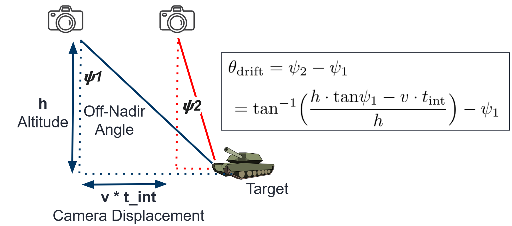
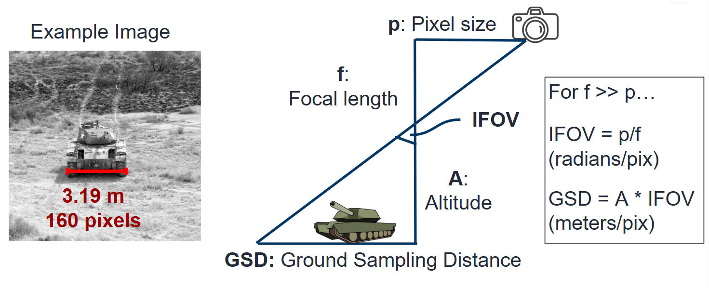
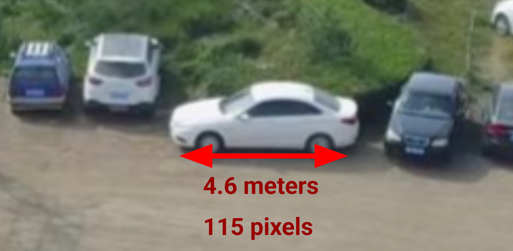
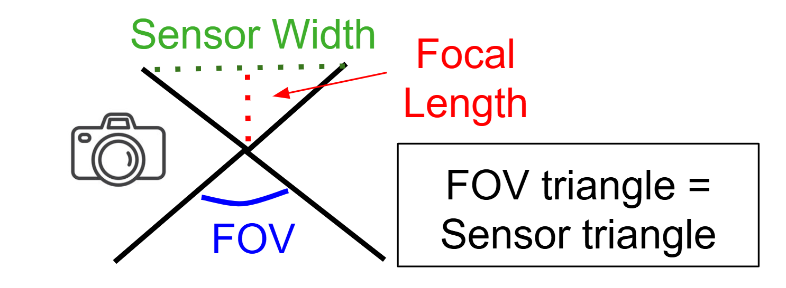
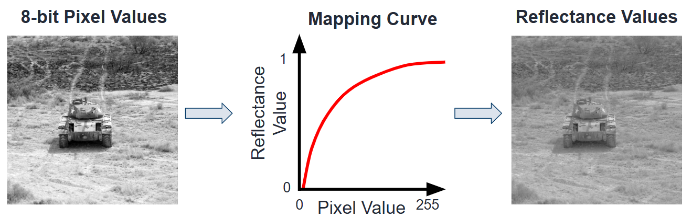

#####################
 Useful Calculations
#####################

This document contains some useful calculations and formulas for some of the pyBSM parameter selections.

*********************************
 Pixel Angular Drift Calculation
*********************************

While a UAV or satellite is capturing an image, the pixel's view of the ground changes during the integration time due
to camera movement. This causes the **Line-of-sight Angular Drift** in the x and y directions (``da_x``, ``da_y``). This
drift is primarily related to the **Integration Time** of the sensor (``int_time``), **Aircraft Speed**
(``aircraft_speed``), and the **Altitude** (``altitude``). Note that some cameras or systems might account or compensate
for this drift, so it is important to check if there is some sort of control system in place.

Assuming there are no control systems, and that all pixels experience the same angular drift, the angular drift is
calculated as the difference in angle of the center of the camera from the starting location to the location after the
integration time (``int_time``):

.. math::

   \theta_{\text{drift}} = \text{tan}^{-1} \Big ( \frac{h \cdot \text{tan} \psi - v \cdot t_{\text{int}}}{h} \Big ) - \psi

where :math:`\theta_{\text{drift}}` is the angular drift in either the x or y direction (``da_x``, ``da_y``), :math:`h`
is the camera's altitude (``altitude``), :math:`v` is the velocity of the aircraft (``aircraft_speed``) in the x or y
direction, :math:`t_{\text{int}}` is the integration time (``int_time``), and :math:`\psi` is the angle of the camera
with respect to nadir. If we assume the camera is pointing in the nadir direction (i.e., :math:`\psi` =0), then this
formula simplifies to:

.. math::

   \theta_{\text{drift}} = \text{tan}^{-1} \Big ( \frac{v \cdot t_{\text{int}}}{h} \Big )

Note that this calculation assumes each pixel experiences the same drift. This might not hold in scenarios that are
close to the ground or have a glancing angle field-of-view.

Here is an example depiction of calculating the pixel drift:

Figure 1: Depiction of pixel drift calculation

****************************************************
 GSD Calculation (known Sensor/Scenario parameters)
****************************************************

The ground sampling distance (GSD) defines how much of the physical scene each pixel captures. This is useful to obtain
size or positional information about the objects of interest. GSD is a function of the scenario, optics, and sensor
size. Specifically, the **Focal Length** (``f``) of the optics, **Pixel Pitch** (``p_x``, ``p_y``) of the sensor, and
**Altitude** (``altitude``) of the aircraft in the scenario. Note that pyBSM assumes each pixel has identical GSD, which
typically holds when imaging very far away and near nadir direction.

Calculating GSD is fairly simple if we assume we are pointing in the nadir direction. This is given by:

.. math::

   \text{Pixel GSD} = \frac{h \cdot p}{f}

where :math:`h` is the aircraft altitude (``altitude``), :math:`p` is the pixel pitch in the x or y direction (``p_x``,
``p_y``), and :math:`f` is the focal length (``f``). Note that this equation can help a user easily design a setup to
capture a specific GSD. For example, a focal length half as long would capture twice the amount of ground in each pixel.

Here is an example of GSD calculation. Note that this is given by the reference image but can also change based on
sensor and scenario variables:

Figure 2: Depiction of GSD calculation based on sensor and scenario variables

..
   TODO: Maybe do off-nadir?

******************************************************
 GSD Calculation (unknown Sensor/Scenario parameters)
******************************************************

In contrast to the previous section, we can also estimate the GSD if we only have an image of the scene with objects of
roughly known size.

For example, the white car in the image below looks similar to a Toyota sedan, which are typically about 4.6m long.

Figure 3: Depiction of GSD calculation based on image approximations

Since the car occupies 115 pixels horizontally, we can approximate the GSD to 4.6/115 = **0.04 meters per pixel**

*****************************************
 Angular Field-of-View (FOV) Calculation
*****************************************

Angular FOV corresponds to the angles captured by the camera sensor. It is independent of scene quantities and is only a
function of the optics focal length ``f`` and the sensor width, also calculated by the pixel size ``p_x`` multiplied by
the number of pixels.

The equation for angular FOV based on these variables is given by:

.. math::

   \theta_{\text{FOV}} = 2\cdot \text{tan}^{-1} \Big ( \frac{p_x \cdot n_{\text{pix}}}{2 \cdot f}  \Big ) = 2\cdot \text{tan}^{-1} \Big ( \frac{w}{2 \cdot f}  \Big )

or if calculating the focal length:

.. math::

   f = \frac{w}{2 \cdot \text{tan}(\theta_{\text{FOV}}/2)} = \frac{p_x \cdot n_{\text{pix}}}{2 \cdot \text{tan}(\theta_{\text{FOV}}/2)},

where :math:`w` is the sensor width, :math:`\theta_{\text{FOV}}` is the horizontal FOV of the camera, and
:math:`n_{\text{pix}}` is the number of horizontal pixels.

Here is a table of tpical sensor widths for different common sensor types you might encounter:

+-----------------------+---------------+----------------------------+----------------------------+
| Sensor Type           | Sensor Width  | Focal Length for 120° FOV  | Focal Length for 50° FOV   |
+=======================+===============+============================+============================+
| 1/2.3" CMOS           | 6.3 mm        | 1.82 mm                    | 6.74 mm                    |
+-----------------------+---------------+----------------------------+----------------------------+
| 1" CMOS               | 13.2 mm       | 3.81 mm                    | 14.1 mm                    |
+-----------------------+---------------+----------------------------+----------------------------+
| Micro Four Thirds     | 17.3 mm       | 5.00 mm                    | 18.5 mm                    |
+-----------------------+---------------+----------------------------+----------------------------+
| APS-C                 | 23.6 mm       | 6.82 mm                    | 25.2 mm                    |
+-----------------------+---------------+----------------------------+----------------------------+
| Full-frame (35mm)     | 36.0 mm       | 10.4 mm                    | 38.4 mm                    |
+-----------------------+---------------+----------------------------+----------------------------+

Here is an example figure depicting this calculation:

Figure 4: Depiction of angular FOV calculation

**************************************
 Pixel Reflectance Value Calculations
**************************************

In order to associate captured pixel values to physical scene reflectance
values, we need to create arrays that associate the values with each other
(this is ``pix_values/refl_values`` for reference image).
This is primarily affected by the **Bit Depth** (``bit_depth`` for
the sensor variables) and the **Gamma Value** (which is typically set be the
user, but the default value is often 2.2). Note that the values of
``pix_values`` goes from 0 to ``bit_depth`` while the values of ``refl_values``
goes from 0 (no reflectance, i.e. perfectly black) to 1 (max reflectance, i.e.
perfectly white).

The formula which relates pixel value to a given reflectance value is given by:

.. math::
   \text{Pixel Value} = (\text{reflectance})^{1/\gamma} \cdot (2^B-1)

where :math:`\gamma` is the gamma value and :math:`B` is the ``bit depth``.

A similar python program to calculate this is given by:

.. code:: python

   import numpy as np

   gamma = 2.2
   bit_depth = 12
   max_pixel = 2**bit_depth - 1

   # Coarsely sample pixel values
   pixel_values = np.arange(0, max_pixel + 1, 128)

   # Inverse gamma correction to get reflectance
   reflectance_values = (pixel_values / max_pixel) ** gamma

   # Print sample arrays
   print("Pixel values:     ", pixel_values)
   print("Reflectance values:", np.round(reflectance_values, 4))

For the default configurations, we assume that the maximum reflectance value we capture is 1 and the minimum is 0. In
reality, this would correspond to other factors such as integration time and the light sources present. However, using
this normalized range should still lend a useful curve for figuring out the scene reflectance values scaled by a
constant factor.

Here is an example depiction of the pixel value to reflectance value mapping:

Figure 5: Depiction of pixel value to reflectance mapping function
